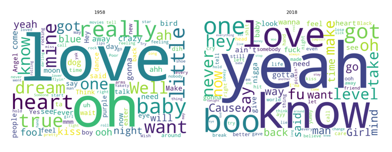
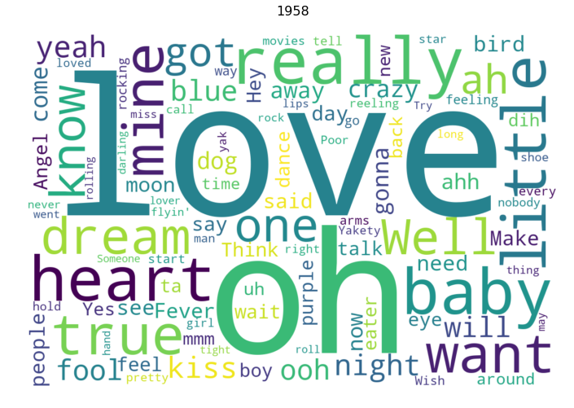
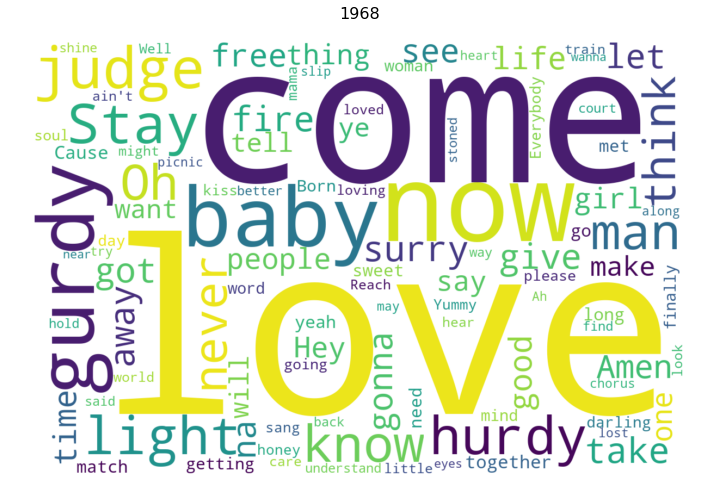
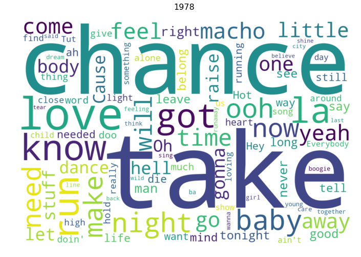
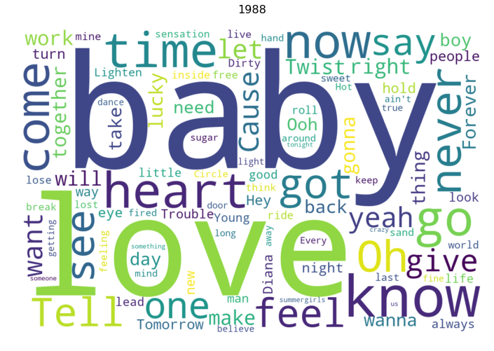
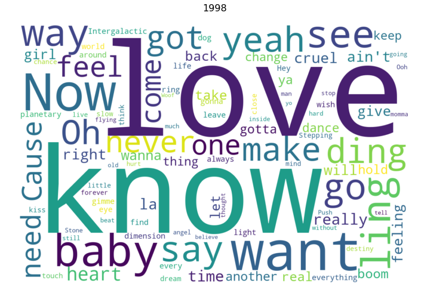
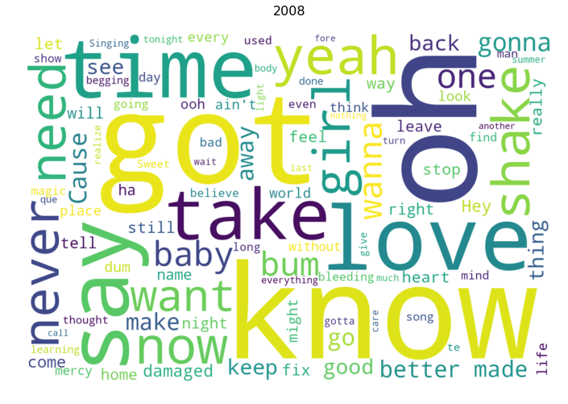
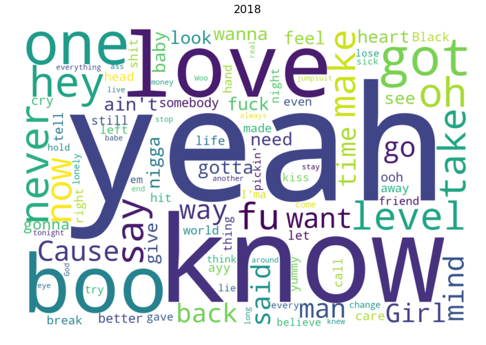

# Analyzing 1958 - 2018 Billboard Chart Song Lyrics

Highlighting popular and trending words in song lyrics using word clouds.

Skills and knowledge: *Python, Jupyter Notebook, Pandas, Data scraping, Data cleansing, Data analysis*




```python
import requests
from bs4 import BeautifulSoup
import pandas as pd
import numpy as np

from wordcloud import WordCloud

import matplotlib.pyplot as plt
% matplotlib inline
```

**1. Collect lists of songs from different years:**


```python
# 1. Collect lists of songs from different years.

# https://www.billboard.com/charts/hot-100/1958-08-01

prepare_df = []

start = "https://www.billboard.com/charts/hot-100/"
year = 1958
end = "-08-01"

while year <= 2018:
    
    url = start + str(year) + end
    response = requests.get(url)

    soup = BeautifulSoup(response.text, 'html.parser')
    songs = soup.find_all("div", class_="chart-list-item")

    index = 0

    while index < len(songs):
        for song in songs:
            artist = songs[index]['data-artist']
            title = songs[index]['data-title']
            
            prepare_df.append({'year': year,
                               'artist': artist,
                               'title': title,
                               'lyric_url': "",
                               'lyric': ""})
            
            print("\r" + str(year) + " / " + title + " "*100, end='')
            index += 1
    
    year += 10
        
df = pd.DataFrame(prepare_df, columns = ['year', 'artist', 'title', 'lyric_url', 'lyric'])
    
df
```

    2018 / Can't Take A Joke                                                                                                    


<div>
<style scoped>
    .dataframe tbody tr th:only-of-type {
        vertical-align: middle;
    }

    .dataframe tbody tr th {
        vertical-align: top;
    }

    .dataframe thead th {
        text-align: right;
    }
</style>
<table border="1" class="dataframe">
  <thead>
    <tr style="text-align: right;">
      <th></th>
      <th>year</th>
      <th>artist</th>
      <th>title</th>
      <th>lyric_url</th>
      <th>lyric</th>
    </tr>
  </thead>
  <tbody>
    <tr>
      <th>0</th>
      <td>1958</td>
      <td>Ricky Nelson</td>
      <td>Poor Little Fool</td>
      <td></td>
      <td></td>
    </tr>
    <tr>
      <th>1</th>
      <td>1958</td>
      <td>Perez Prado And His Orchestra</td>
      <td>Patricia</td>
      <td></td>
      <td></td>
    </tr>
    <tr>
      <th>2</th>
      <td>1958</td>
      <td>Bobby Darin</td>
      <td>Splish Splash</td>
      <td></td>
      <td></td>
    </tr>
    <tr>
      <th>3</th>
      <td>1958</td>
      <td>Elvis Presley With The Jordanaires</td>
      <td>Hard Headed Woman</td>
      <td></td>
      <td></td>
    </tr>
    <tr>
      <th>4</th>
      <td>1958</td>
      <td>Kalin Twins</td>
      <td>When</td>
      <td></td>
      <td></td>
    </tr>
    <tr>
      <th>5</th>
      <td>1958</td>
      <td>Duane Eddy His Twangy Guitar And The Rebels</td>
      <td>Rebel-'rouser</td>
      <td></td>
      <td></td>
    </tr>
    <tr>
      <th>6</th>
      <td>1958</td>
      <td>The Coasters</td>
      <td>Yakety Yak</td>
      <td></td>
      <td></td>
    </tr>
    <tr>
      <th>7</th>
      <td>1958</td>
      <td>Jack Scott</td>
      <td>My True Love</td>
      <td></td>
      <td></td>
    </tr>
    <tr>
      <th>8</th>
      <td>1958</td>
      <td>The Johnny Otis Show</td>
      <td>Willie And The Hand Jive</td>
      <td></td>
      <td></td>
    </tr>
    <tr>
      <th>9</th>
      <td>1958</td>
      <td>Peggy Lee</td>
      <td>Fever</td>
      <td></td>
      <td></td>
    </tr>
    <tr>
      <th>10</th>
      <td>1958</td>
      <td>Frankie Avalon</td>
      <td>Ginger Bread</td>
      <td></td>
      <td></td>
    </tr>
    <tr>
      <th>11</th>
      <td>1958</td>
      <td>Jimmy Clanton And His Rockets</td>
      <td>Just A Dream</td>
      <td></td>
      <td></td>
    </tr>
    <tr>
      <th>12</th>
      <td>1958</td>
      <td>Patti Page</td>
      <td>Left Right Out Of Your Heart (Hi Lee Hi Lo Hi ...</td>
      <td></td>
      <td></td>
    </tr>
    <tr>
      <th>13</th>
      <td>1958</td>
      <td>Pat Boone</td>
      <td>If Dreams Came True</td>
      <td></td>
      <td></td>
    </tr>
    <tr>
      <th>14</th>
      <td>1958</td>
      <td>Jerry Butler and The Impressions</td>
      <td>For Your Precious Love</td>
      <td></td>
      <td></td>
    </tr>
    <tr>
      <th>15</th>
      <td>1958</td>
      <td>The Danleers</td>
      <td>One Summer Night</td>
      <td></td>
      <td></td>
    </tr>
    <tr>
      <th>16</th>
      <td>1958</td>
      <td>Jody Reynolds</td>
      <td>Endless Sleep</td>
      <td></td>
      <td></td>
    </tr>
    <tr>
      <th>17</th>
      <td>1958</td>
      <td>The Elegants</td>
      <td>Little Star</td>
      <td></td>
      <td></td>
    </tr>
    <tr>
      <th>18</th>
      <td>1958</td>
      <td>Doris Day</td>
      <td>Everybody Loves A Lover</td>
      <td></td>
      <td></td>
    </tr>
    <tr>
      <th>19</th>
      <td>1958</td>
      <td>Bobby Freeman</td>
      <td>Do You Want To Dance</td>
      <td></td>
      <td></td>
    </tr>
    <tr>
      <th>20</th>
      <td>1958</td>
      <td>Johnny Cash And The Tennessee Two</td>
      <td>Guess Things Happen That Way</td>
      <td></td>
      <td></td>
    </tr>
    <tr>
      <th>21</th>
      <td>1958</td>
      <td>Johnny Mathis</td>
      <td>A Certain Smile</td>
      <td></td>
      <td></td>
    </tr>
    <tr>
      <th>22</th>
      <td>1958</td>
      <td>The Olympics</td>
      <td>Western Movies</td>
      <td></td>
      <td></td>
    </tr>
    <tr>
      <th>23</th>
      <td>1958</td>
      <td>Sheb Wooley</td>
      <td>The Purple People Eater</td>
      <td></td>
      <td></td>
    </tr>
    <tr>
      <th>24</th>
      <td>1958</td>
      <td>Chuck Willis</td>
      <td>What Am I Living For</td>
      <td></td>
      <td></td>
    </tr>
    <tr>
      <th>25</th>
      <td>1958</td>
      <td>Poni-Tails</td>
      <td>Born Too Late</td>
      <td></td>
      <td></td>
    </tr>
    <tr>
      <th>26</th>
      <td>1958</td>
      <td>The Crickets</td>
      <td>Think It Over</td>
      <td></td>
      <td></td>
    </tr>
    <tr>
      <th>27</th>
      <td>1958</td>
      <td>Jimmie Rodgers</td>
      <td>Secretly</td>
      <td></td>
      <td></td>
    </tr>
    <tr>
      <th>28</th>
      <td>1958</td>
      <td>The Four Lads</td>
      <td>Enchanted Island</td>
      <td></td>
      <td></td>
    </tr>
    <tr>
      <th>29</th>
      <td>1958</td>
      <td>Dean Martin</td>
      <td>Angel Baby</td>
      <td></td>
      <td></td>
    </tr>
    <tr>
      <th>...</th>
      <td>...</td>
      <td>...</td>
      <td>...</td>
      <td>...</td>
      <td>...</td>
    </tr>
    <tr>
      <th>670</th>
      <td>2018</td>
      <td>Morgan Evans</td>
      <td>Kiss Somebody</td>
      <td></td>
      <td></td>
    </tr>
    <tr>
      <th>671</th>
      <td>2018</td>
      <td>Becky G + Natti Natasha</td>
      <td>Sin Pijama</td>
      <td></td>
      <td></td>
    </tr>
    <tr>
      <th>672</th>
      <td>2018</td>
      <td>Lil Dicky Featuring Chris Brown</td>
      <td>Freaky Friday</td>
      <td></td>
      <td></td>
    </tr>
    <tr>
      <th>673</th>
      <td>2018</td>
      <td>Lauren Daigle</td>
      <td>You Say</td>
      <td></td>
      <td></td>
    </tr>
    <tr>
      <th>674</th>
      <td>2018</td>
      <td>lovelytheband</td>
      <td>Broken</td>
      <td></td>
      <td></td>
    </tr>
    <tr>
      <th>675</th>
      <td>2018</td>
      <td>Dylan Scott</td>
      <td>Hooked</td>
      <td></td>
      <td></td>
    </tr>
    <tr>
      <th>676</th>
      <td>2018</td>
      <td>Ciara</td>
      <td>Level Up</td>
      <td></td>
      <td></td>
    </tr>
    <tr>
      <th>677</th>
      <td>2018</td>
      <td>TK Kravitz Featuring Jacqueez</td>
      <td>Ocean</td>
      <td></td>
      <td></td>
    </tr>
    <tr>
      <th>678</th>
      <td>2018</td>
      <td>Kygo Featuring Miguel</td>
      <td>Remind Me To Forget</td>
      <td></td>
      <td></td>
    </tr>
    <tr>
      <th>679</th>
      <td>2018</td>
      <td>Khalid, Ty Dolla $ign &amp; 6LACK</td>
      <td>OTW</td>
      <td></td>
      <td></td>
    </tr>
    <tr>
      <th>680</th>
      <td>2018</td>
      <td>Daniel Caesar Featuring H.E.R.</td>
      <td>Best Part</td>
      <td></td>
      <td></td>
    </tr>
    <tr>
      <th>681</th>
      <td>2018</td>
      <td>G-Eazy Featuring Yo Gotti &amp; YBN Nahmir</td>
      <td>1942</td>
      <td></td>
      <td></td>
    </tr>
    <tr>
      <th>682</th>
      <td>2018</td>
      <td>Post Malone Featuring Nicki Minaj</td>
      <td>Ball For Me</td>
      <td></td>
      <td></td>
    </tr>
    <tr>
      <th>683</th>
      <td>2018</td>
      <td>Carrie Underwood</td>
      <td>Cry Pretty</td>
      <td></td>
      <td></td>
    </tr>
    <tr>
      <th>684</th>
      <td>2018</td>
      <td>Martin Garrix Featuring Khalid</td>
      <td>Ocean</td>
      <td></td>
      <td></td>
    </tr>
    <tr>
      <th>685</th>
      <td>2018</td>
      <td>Weezer</td>
      <td>Africa</td>
      <td></td>
      <td></td>
    </tr>
    <tr>
      <th>686</th>
      <td>2018</td>
      <td>Cole Swindell</td>
      <td>Break Up In The End</td>
      <td></td>
      <td></td>
    </tr>
    <tr>
      <th>687</th>
      <td>2018</td>
      <td>twenty one pilots</td>
      <td>Jumpsuit</td>
      <td></td>
      <td></td>
    </tr>
    <tr>
      <th>688</th>
      <td>2018</td>
      <td>The Weeknd</td>
      <td>Call Out My Name</td>
      <td></td>
      <td></td>
    </tr>
    <tr>
      <th>689</th>
      <td>2018</td>
      <td>Dennis Lloyd</td>
      <td>Nevermind</td>
      <td></td>
      <td></td>
    </tr>
    <tr>
      <th>690</th>
      <td>2018</td>
      <td>Kanye West</td>
      <td>All Mine</td>
      <td></td>
      <td></td>
    </tr>
    <tr>
      <th>691</th>
      <td>2018</td>
      <td>Migos</td>
      <td>Narcos</td>
      <td></td>
      <td></td>
    </tr>
    <tr>
      <th>692</th>
      <td>2018</td>
      <td>Billie Eilish</td>
      <td>You Should See Me In A Crown</td>
      <td></td>
      <td></td>
    </tr>
    <tr>
      <th>693</th>
      <td>2018</td>
      <td>Eric Church</td>
      <td>Desperate Man</td>
      <td></td>
      <td></td>
    </tr>
    <tr>
      <th>694</th>
      <td>2018</td>
      <td>Wiz Khalifa Featuring Swae Lee</td>
      <td>Hopeless Romantic</td>
      <td></td>
      <td></td>
    </tr>
    <tr>
      <th>695</th>
      <td>2018</td>
      <td>A$AP Rocky Featuring Skepta</td>
      <td>Praise The Lord (Da Shine)</td>
      <td></td>
      <td></td>
    </tr>
    <tr>
      <th>696</th>
      <td>2018</td>
      <td>NF</td>
      <td>Lie</td>
      <td></td>
      <td></td>
    </tr>
    <tr>
      <th>697</th>
      <td>2018</td>
      <td>Kane Brown</td>
      <td>Lose It</td>
      <td></td>
      <td></td>
    </tr>
    <tr>
      <th>698</th>
      <td>2018</td>
      <td>Drake</td>
      <td>Emotionless</td>
      <td></td>
      <td></td>
    </tr>
    <tr>
      <th>699</th>
      <td>2018</td>
      <td>Drake</td>
      <td>Can't Take A Joke</td>
      <td></td>
      <td></td>
    </tr>
  </tbody>
</table>
<p>700 rows × 5 columns</p>
</div>


**2. Generate lyric URLs for these songs:**


```python
# 2. Generate lyric URLs for these songs.

# https://genius.com/ricky-nelson-poor-little-fool-lyrics
start = "https://genius.com/"
end = "-lyrics"

for index, row in df.iterrows():
    
    df.at[index, 'lyric_url'] = (start 
                                 + df.at[index, 'artist'].lower().replace(" ", "-")
                                 + "-"
                                 + df.at[index, 'title'].lower().replace(" ", "-")
                                 + end)
    
df
```


<div>
<style scoped>
    .dataframe tbody tr th:only-of-type {
        vertical-align: middle;
    }

    .dataframe tbody tr th {
        vertical-align: top;
    }

    .dataframe thead th {
        text-align: right;
    }
</style>
<table border="1" class="dataframe">
  <thead>
    <tr style="text-align: right;">
      <th></th>
      <th>year</th>
      <th>artist</th>
      <th>title</th>
      <th>lyric_url</th>
      <th>lyric</th>
    </tr>
  </thead>
  <tbody>
    <tr>
      <th>0</th>
      <td>1958</td>
      <td>Ricky Nelson</td>
      <td>Poor Little Fool</td>
      <td>https://genius.com/ricky-nelson-poor-little-fo...</td>
      <td></td>
    </tr>
    <tr>
      <th>1</th>
      <td>1958</td>
      <td>Perez Prado And His Orchestra</td>
      <td>Patricia</td>
      <td>https://genius.com/perez-prado-and-his-orchest...</td>
      <td></td>
    </tr>
    <tr>
      <th>2</th>
      <td>1958</td>
      <td>Bobby Darin</td>
      <td>Splish Splash</td>
      <td>https://genius.com/bobby-darin-splish-splash-l...</td>
      <td></td>
    </tr>
    <tr>
      <th>3</th>
      <td>1958</td>
      <td>Elvis Presley With The Jordanaires</td>
      <td>Hard Headed Woman</td>
      <td>https://genius.com/elvis-presley-with-the-jord...</td>
      <td></td>
    </tr>
    <tr>
      <th>4</th>
      <td>1958</td>
      <td>Kalin Twins</td>
      <td>When</td>
      <td>https://genius.com/kalin-twins-when-lyrics</td>
      <td></td>
    </tr>
    <tr>
      <th>5</th>
      <td>1958</td>
      <td>Duane Eddy His Twangy Guitar And The Rebels</td>
      <td>Rebel-'rouser</td>
      <td>https://genius.com/duane-eddy-his-twangy-guita...</td>
      <td></td>
    </tr>
    <tr>
      <th>6</th>
      <td>1958</td>
      <td>The Coasters</td>
      <td>Yakety Yak</td>
      <td>https://genius.com/the-coasters-yakety-yak-lyrics</td>
      <td></td>
    </tr>
    <tr>
      <th>7</th>
      <td>1958</td>
      <td>Jack Scott</td>
      <td>My True Love</td>
      <td>https://genius.com/jack-scott-my-true-love-lyrics</td>
      <td></td>
    </tr>
    <tr>
      <th>8</th>
      <td>1958</td>
      <td>The Johnny Otis Show</td>
      <td>Willie And The Hand Jive</td>
      <td>https://genius.com/the-johnny-otis-show-willie...</td>
      <td></td>
    </tr>
    <tr>
      <th>9</th>
      <td>1958</td>
      <td>Peggy Lee</td>
      <td>Fever</td>
      <td>https://genius.com/peggy-lee-fever-lyrics</td>
      <td></td>
    </tr>
    <tr>
      <th>10</th>
      <td>1958</td>
      <td>Frankie Avalon</td>
      <td>Ginger Bread</td>
      <td>https://genius.com/frankie-avalon-ginger-bread...</td>
      <td></td>
    </tr>
    <tr>
      <th>11</th>
      <td>1958</td>
      <td>Jimmy Clanton And His Rockets</td>
      <td>Just A Dream</td>
      <td>https://genius.com/jimmy-clanton-and-his-rocke...</td>
      <td></td>
    </tr>
    <tr>
      <th>12</th>
      <td>1958</td>
      <td>Patti Page</td>
      <td>Left Right Out Of Your Heart (Hi Lee Hi Lo Hi ...</td>
      <td>https://genius.com/patti-page-left-right-out-o...</td>
      <td></td>
    </tr>
    <tr>
      <th>13</th>
      <td>1958</td>
      <td>Pat Boone</td>
      <td>If Dreams Came True</td>
      <td>https://genius.com/pat-boone-if-dreams-came-tr...</td>
      <td></td>
    </tr>
    <tr>
      <th>14</th>
      <td>1958</td>
      <td>Jerry Butler and The Impressions</td>
      <td>For Your Precious Love</td>
      <td>https://genius.com/jerry-butler-and-the-impres...</td>
      <td></td>
    </tr>
    <tr>
      <th>15</th>
      <td>1958</td>
      <td>The Danleers</td>
      <td>One Summer Night</td>
      <td>https://genius.com/the-danleers-one-summer-nig...</td>
      <td></td>
    </tr>
    <tr>
      <th>16</th>
      <td>1958</td>
      <td>Jody Reynolds</td>
      <td>Endless Sleep</td>
      <td>https://genius.com/jody-reynolds-endless-sleep...</td>
      <td></td>
    </tr>
    <tr>
      <th>17</th>
      <td>1958</td>
      <td>The Elegants</td>
      <td>Little Star</td>
      <td>https://genius.com/the-elegants-little-star-ly...</td>
      <td></td>
    </tr>
    <tr>
      <th>18</th>
      <td>1958</td>
      <td>Doris Day</td>
      <td>Everybody Loves A Lover</td>
      <td>https://genius.com/doris-day-everybody-loves-a...</td>
      <td></td>
    </tr>
    <tr>
      <th>19</th>
      <td>1958</td>
      <td>Bobby Freeman</td>
      <td>Do You Want To Dance</td>
      <td>https://genius.com/bobby-freeman-do-you-want-t...</td>
      <td></td>
    </tr>
    <tr>
      <th>20</th>
      <td>1958</td>
      <td>Johnny Cash And The Tennessee Two</td>
      <td>Guess Things Happen That Way</td>
      <td>https://genius.com/johnny-cash-and-the-tenness...</td>
      <td></td>
    </tr>
    <tr>
      <th>21</th>
      <td>1958</td>
      <td>Johnny Mathis</td>
      <td>A Certain Smile</td>
      <td>https://genius.com/johnny-mathis-a-certain-smi...</td>
      <td></td>
    </tr>
    <tr>
      <th>22</th>
      <td>1958</td>
      <td>The Olympics</td>
      <td>Western Movies</td>
      <td>https://genius.com/the-olympics-western-movies...</td>
      <td></td>
    </tr>
    <tr>
      <th>23</th>
      <td>1958</td>
      <td>Sheb Wooley</td>
      <td>The Purple People Eater</td>
      <td>https://genius.com/sheb-wooley-the-purple-peop...</td>
      <td></td>
    </tr>
    <tr>
      <th>24</th>
      <td>1958</td>
      <td>Chuck Willis</td>
      <td>What Am I Living For</td>
      <td>https://genius.com/chuck-willis-what-am-i-livi...</td>
      <td></td>
    </tr>
    <tr>
      <th>25</th>
      <td>1958</td>
      <td>Poni-Tails</td>
      <td>Born Too Late</td>
      <td>https://genius.com/poni-tails-born-too-late-ly...</td>
      <td></td>
    </tr>
    <tr>
      <th>26</th>
      <td>1958</td>
      <td>The Crickets</td>
      <td>Think It Over</td>
      <td>https://genius.com/the-crickets-think-it-over-...</td>
      <td></td>
    </tr>
    <tr>
      <th>27</th>
      <td>1958</td>
      <td>Jimmie Rodgers</td>
      <td>Secretly</td>
      <td>https://genius.com/jimmie-rodgers-secretly-lyrics</td>
      <td></td>
    </tr>
    <tr>
      <th>28</th>
      <td>1958</td>
      <td>The Four Lads</td>
      <td>Enchanted Island</td>
      <td>https://genius.com/the-four-lads-enchanted-isl...</td>
      <td></td>
    </tr>
    <tr>
      <th>29</th>
      <td>1958</td>
      <td>Dean Martin</td>
      <td>Angel Baby</td>
      <td>https://genius.com/dean-martin-angel-baby-lyrics</td>
      <td></td>
    </tr>
    <tr>
      <th>...</th>
      <td>...</td>
      <td>...</td>
      <td>...</td>
      <td>...</td>
      <td>...</td>
    </tr>
    <tr>
      <th>670</th>
      <td>2018</td>
      <td>Morgan Evans</td>
      <td>Kiss Somebody</td>
      <td>https://genius.com/morgan-evans-kiss-somebody-...</td>
      <td></td>
    </tr>
    <tr>
      <th>671</th>
      <td>2018</td>
      <td>Becky G + Natti Natasha</td>
      <td>Sin Pijama</td>
      <td>https://genius.com/becky-g-+-natti-natasha-sin...</td>
      <td></td>
    </tr>
    <tr>
      <th>672</th>
      <td>2018</td>
      <td>Lil Dicky Featuring Chris Brown</td>
      <td>Freaky Friday</td>
      <td>https://genius.com/lil-dicky-featuring-chris-b...</td>
      <td></td>
    </tr>
    <tr>
      <th>673</th>
      <td>2018</td>
      <td>Lauren Daigle</td>
      <td>You Say</td>
      <td>https://genius.com/lauren-daigle-you-say-lyrics</td>
      <td></td>
    </tr>
    <tr>
      <th>674</th>
      <td>2018</td>
      <td>lovelytheband</td>
      <td>Broken</td>
      <td>https://genius.com/lovelytheband-broken-lyrics</td>
      <td></td>
    </tr>
    <tr>
      <th>675</th>
      <td>2018</td>
      <td>Dylan Scott</td>
      <td>Hooked</td>
      <td>https://genius.com/dylan-scott-hooked-lyrics</td>
      <td></td>
    </tr>
    <tr>
      <th>676</th>
      <td>2018</td>
      <td>Ciara</td>
      <td>Level Up</td>
      <td>https://genius.com/ciara-level-up-lyrics</td>
      <td></td>
    </tr>
    <tr>
      <th>677</th>
      <td>2018</td>
      <td>TK Kravitz Featuring Jacqueez</td>
      <td>Ocean</td>
      <td>https://genius.com/tk-kravitz-featuring-jacque...</td>
      <td></td>
    </tr>
    <tr>
      <th>678</th>
      <td>2018</td>
      <td>Kygo Featuring Miguel</td>
      <td>Remind Me To Forget</td>
      <td>https://genius.com/kygo-featuring-miguel-remin...</td>
      <td></td>
    </tr>
    <tr>
      <th>679</th>
      <td>2018</td>
      <td>Khalid, Ty Dolla $ign &amp; 6LACK</td>
      <td>OTW</td>
      <td>https://genius.com/khalid,-ty-dolla-$ign-&amp;-6la...</td>
      <td></td>
    </tr>
    <tr>
      <th>680</th>
      <td>2018</td>
      <td>Daniel Caesar Featuring H.E.R.</td>
      <td>Best Part</td>
      <td>https://genius.com/daniel-caesar-featuring-h.e...</td>
      <td></td>
    </tr>
    <tr>
      <th>681</th>
      <td>2018</td>
      <td>G-Eazy Featuring Yo Gotti &amp; YBN Nahmir</td>
      <td>1942</td>
      <td>https://genius.com/g-eazy-featuring-yo-gotti-&amp;...</td>
      <td></td>
    </tr>
    <tr>
      <th>682</th>
      <td>2018</td>
      <td>Post Malone Featuring Nicki Minaj</td>
      <td>Ball For Me</td>
      <td>https://genius.com/post-malone-featuring-nicki...</td>
      <td></td>
    </tr>
    <tr>
      <th>683</th>
      <td>2018</td>
      <td>Carrie Underwood</td>
      <td>Cry Pretty</td>
      <td>https://genius.com/carrie-underwood-cry-pretty...</td>
      <td></td>
    </tr>
    <tr>
      <th>684</th>
      <td>2018</td>
      <td>Martin Garrix Featuring Khalid</td>
      <td>Ocean</td>
      <td>https://genius.com/martin-garrix-featuring-kha...</td>
      <td></td>
    </tr>
    <tr>
      <th>685</th>
      <td>2018</td>
      <td>Weezer</td>
      <td>Africa</td>
      <td>https://genius.com/weezer-africa-lyrics</td>
      <td></td>
    </tr>
    <tr>
      <th>686</th>
      <td>2018</td>
      <td>Cole Swindell</td>
      <td>Break Up In The End</td>
      <td>https://genius.com/cole-swindell-break-up-in-t...</td>
      <td></td>
    </tr>
    <tr>
      <th>687</th>
      <td>2018</td>
      <td>twenty one pilots</td>
      <td>Jumpsuit</td>
      <td>https://genius.com/twenty-one-pilots-jumpsuit-...</td>
      <td></td>
    </tr>
    <tr>
      <th>688</th>
      <td>2018</td>
      <td>The Weeknd</td>
      <td>Call Out My Name</td>
      <td>https://genius.com/the-weeknd-call-out-my-name...</td>
      <td></td>
    </tr>
    <tr>
      <th>689</th>
      <td>2018</td>
      <td>Dennis Lloyd</td>
      <td>Nevermind</td>
      <td>https://genius.com/dennis-lloyd-nevermind-lyrics</td>
      <td></td>
    </tr>
    <tr>
      <th>690</th>
      <td>2018</td>
      <td>Kanye West</td>
      <td>All Mine</td>
      <td>https://genius.com/kanye-west-all-mine-lyrics</td>
      <td></td>
    </tr>
    <tr>
      <th>691</th>
      <td>2018</td>
      <td>Migos</td>
      <td>Narcos</td>
      <td>https://genius.com/migos-narcos-lyrics</td>
      <td></td>
    </tr>
    <tr>
      <th>692</th>
      <td>2018</td>
      <td>Billie Eilish</td>
      <td>You Should See Me In A Crown</td>
      <td>https://genius.com/billie-eilish-you-should-se...</td>
      <td></td>
    </tr>
    <tr>
      <th>693</th>
      <td>2018</td>
      <td>Eric Church</td>
      <td>Desperate Man</td>
      <td>https://genius.com/eric-church-desperate-man-l...</td>
      <td></td>
    </tr>
    <tr>
      <th>694</th>
      <td>2018</td>
      <td>Wiz Khalifa Featuring Swae Lee</td>
      <td>Hopeless Romantic</td>
      <td>https://genius.com/wiz-khalifa-featuring-swae-...</td>
      <td></td>
    </tr>
    <tr>
      <th>695</th>
      <td>2018</td>
      <td>A$AP Rocky Featuring Skepta</td>
      <td>Praise The Lord (Da Shine)</td>
      <td>https://genius.com/a$ap-rocky-featuring-skepta...</td>
      <td></td>
    </tr>
    <tr>
      <th>696</th>
      <td>2018</td>
      <td>NF</td>
      <td>Lie</td>
      <td>https://genius.com/nf-lie-lyrics</td>
      <td></td>
    </tr>
    <tr>
      <th>697</th>
      <td>2018</td>
      <td>Kane Brown</td>
      <td>Lose It</td>
      <td>https://genius.com/kane-brown-lose-it-lyrics</td>
      <td></td>
    </tr>
    <tr>
      <th>698</th>
      <td>2018</td>
      <td>Drake</td>
      <td>Emotionless</td>
      <td>https://genius.com/drake-emotionless-lyrics</td>
      <td></td>
    </tr>
    <tr>
      <th>699</th>
      <td>2018</td>
      <td>Drake</td>
      <td>Can't Take A Joke</td>
      <td>https://genius.com/drake-can't-take-a-joke-lyrics</td>
      <td></td>
    </tr>
  </tbody>
</table>
<p>700 rows × 5 columns</p>
</div>


**3. Try to get the lyrics from web:**


```python
# 3. Try to get the lyrics from web.

for index, row in df.iterrows():
    
    url = df.at[index, 'lyric_url']
    response = requests.get(url)

    try:
        soup = BeautifulSoup(response.text, 'html.parser')
        lyric_soup = soup.find("div", class_="lyrics")

        df.at[index, 'lyric'] = lyric_soup.text.replace("\n", " ")
    except:
        df.at[index, 'lyric'] = np.NaN
        
df
```


<div>
<style scoped>
    .dataframe tbody tr th:only-of-type {
        vertical-align: middle;
    }

    .dataframe tbody tr th {
        vertical-align: top;
    }

    .dataframe thead th {
        text-align: right;
    }
</style>
<table border="1" class="dataframe">
  <thead>
    <tr style="text-align: right;">
      <th></th>
      <th>year</th>
      <th>artist</th>
      <th>title</th>
      <th>lyric_url</th>
      <th>lyric</th>
    </tr>
  </thead>
  <tbody>
    <tr>
      <th>0</th>
      <td>1958</td>
      <td>Ricky Nelson</td>
      <td>Poor Little Fool</td>
      <td>https://genius.com/ricky-nelson-poor-little-fo...</td>
      <td>I used to play around with hearts That haste...</td>
    </tr>
    <tr>
      <th>1</th>
      <td>1958</td>
      <td>Perez Prado And His Orchestra</td>
      <td>Patricia</td>
      <td>https://genius.com/perez-prado-and-his-orchest...</td>
      <td>NaN</td>
    </tr>
    <tr>
      <th>2</th>
      <td>1958</td>
      <td>Bobby Darin</td>
      <td>Splish Splash</td>
      <td>https://genius.com/bobby-darin-splish-splash-l...</td>
      <td>Splish splash, I was taking a bath Long abou...</td>
    </tr>
    <tr>
      <th>3</th>
      <td>1958</td>
      <td>Elvis Presley With The Jordanaires</td>
      <td>Hard Headed Woman</td>
      <td>https://genius.com/elvis-presley-with-the-jord...</td>
      <td>NaN</td>
    </tr>
    <tr>
      <th>4</th>
      <td>1958</td>
      <td>Kalin Twins</td>
      <td>When</td>
      <td>https://genius.com/kalin-twins-when-lyrics</td>
      <td>When, when you smile, when you smile at me W...</td>
    </tr>
    <tr>
      <th>5</th>
      <td>1958</td>
      <td>Duane Eddy His Twangy Guitar And The Rebels</td>
      <td>Rebel-'rouser</td>
      <td>https://genius.com/duane-eddy-his-twangy-guita...</td>
      <td>NaN</td>
    </tr>
    <tr>
      <th>6</th>
      <td>1958</td>
      <td>The Coasters</td>
      <td>Yakety Yak</td>
      <td>https://genius.com/the-coasters-yakety-yak-lyrics</td>
      <td>Take out the papers and the trash Or you don...</td>
    </tr>
    <tr>
      <th>7</th>
      <td>1958</td>
      <td>Jack Scott</td>
      <td>My True Love</td>
      <td>https://genius.com/jack-scott-my-true-love-lyrics</td>
      <td>I prayed to the Lord to send me a love He se...</td>
    </tr>
    <tr>
      <th>8</th>
      <td>1958</td>
      <td>The Johnny Otis Show</td>
      <td>Willie And The Hand Jive</td>
      <td>https://genius.com/the-johnny-otis-show-willie...</td>
      <td>NaN</td>
    </tr>
    <tr>
      <th>9</th>
      <td>1958</td>
      <td>Peggy Lee</td>
      <td>Fever</td>
      <td>https://genius.com/peggy-lee-fever-lyrics</td>
      <td>Never know how much I love you Never know ho...</td>
    </tr>
    <tr>
      <th>10</th>
      <td>1958</td>
      <td>Frankie Avalon</td>
      <td>Ginger Bread</td>
      <td>https://genius.com/frankie-avalon-ginger-bread...</td>
      <td>You're full of sugar you're full of spice Yo...</td>
    </tr>
    <tr>
      <th>11</th>
      <td>1958</td>
      <td>Jimmy Clanton And His Rockets</td>
      <td>Just A Dream</td>
      <td>https://genius.com/jimmy-clanton-and-his-rocke...</td>
      <td>NaN</td>
    </tr>
    <tr>
      <th>12</th>
      <td>1958</td>
      <td>Patti Page</td>
      <td>Left Right Out Of Your Heart (Hi Lee Hi Lo Hi ...</td>
      <td>https://genius.com/patti-page-left-right-out-o...</td>
      <td>NaN</td>
    </tr>
    <tr>
      <th>13</th>
      <td>1958</td>
      <td>Pat Boone</td>
      <td>If Dreams Came True</td>
      <td>https://genius.com/pat-boone-if-dreams-came-tr...</td>
      <td>Oh my darling, oh my lover  If dreams came t...</td>
    </tr>
    <tr>
      <th>14</th>
      <td>1958</td>
      <td>Jerry Butler and The Impressions</td>
      <td>For Your Precious Love</td>
      <td>https://genius.com/jerry-butler-and-the-impres...</td>
      <td>NaN</td>
    </tr>
    <tr>
      <th>15</th>
      <td>1958</td>
      <td>The Danleers</td>
      <td>One Summer Night</td>
      <td>https://genius.com/the-danleers-one-summer-nig...</td>
      <td>One summer night, we fell in love One summer...</td>
    </tr>
    <tr>
      <th>16</th>
      <td>1958</td>
      <td>Jody Reynolds</td>
      <td>Endless Sleep</td>
      <td>https://genius.com/jody-reynolds-endless-sleep...</td>
      <td>VERSE 1 The night was black, rain falling do...</td>
    </tr>
    <tr>
      <th>17</th>
      <td>1958</td>
      <td>The Elegants</td>
      <td>Little Star</td>
      <td>https://genius.com/the-elegants-little-star-ly...</td>
      <td>Where are you little star? (Where are you?) ...</td>
    </tr>
    <tr>
      <th>18</th>
      <td>1958</td>
      <td>Doris Day</td>
      <td>Everybody Loves A Lover</td>
      <td>https://genius.com/doris-day-everybody-loves-a...</td>
      <td>Everybody loves a lover I'm a lover, everybo...</td>
    </tr>
    <tr>
      <th>19</th>
      <td>1958</td>
      <td>Bobby Freeman</td>
      <td>Do You Want To Dance</td>
      <td>https://genius.com/bobby-freeman-do-you-want-t...</td>
      <td>Do you want to dance and hold my hand? Tell ...</td>
    </tr>
    <tr>
      <th>20</th>
      <td>1958</td>
      <td>Johnny Cash And The Tennessee Two</td>
      <td>Guess Things Happen That Way</td>
      <td>https://genius.com/johnny-cash-and-the-tenness...</td>
      <td>NaN</td>
    </tr>
    <tr>
      <th>21</th>
      <td>1958</td>
      <td>Johnny Mathis</td>
      <td>A Certain Smile</td>
      <td>https://genius.com/johnny-mathis-a-certain-smi...</td>
      <td>A certain smile, a certain face Can lead an ...</td>
    </tr>
    <tr>
      <th>22</th>
      <td>1958</td>
      <td>The Olympics</td>
      <td>Western Movies</td>
      <td>https://genius.com/the-olympics-western-movies...</td>
      <td>To save my soul I can't get a date Baby's go...</td>
    </tr>
    <tr>
      <th>23</th>
      <td>1958</td>
      <td>Sheb Wooley</td>
      <td>The Purple People Eater</td>
      <td>https://genius.com/sheb-wooley-the-purple-peop...</td>
      <td>AAAAAHHHH!!!!!!!!!  Well, I saw the thing co...</td>
    </tr>
    <tr>
      <th>24</th>
      <td>1958</td>
      <td>Chuck Willis</td>
      <td>What Am I Living For</td>
      <td>https://genius.com/chuck-willis-what-am-i-livi...</td>
      <td>What am I living for, if not for you? What a...</td>
    </tr>
    <tr>
      <th>25</th>
      <td>1958</td>
      <td>Poni-Tails</td>
      <td>Born Too Late</td>
      <td>https://genius.com/poni-tails-born-too-late-ly...</td>
      <td>NaN</td>
    </tr>
    <tr>
      <th>26</th>
      <td>1958</td>
      <td>The Crickets</td>
      <td>Think It Over</td>
      <td>https://genius.com/the-crickets-think-it-over-...</td>
      <td>Think it over, what you've just said Think i...</td>
    </tr>
    <tr>
      <th>27</th>
      <td>1958</td>
      <td>Jimmie Rodgers</td>
      <td>Secretly</td>
      <td>https://genius.com/jimmie-rodgers-secretly-lyrics</td>
      <td>Do do do do do do do do do do do do Do do do...</td>
    </tr>
    <tr>
      <th>28</th>
      <td>1958</td>
      <td>The Four Lads</td>
      <td>Enchanted Island</td>
      <td>https://genius.com/the-four-lads-enchanted-isl...</td>
      <td>True love Is an enchanted island And we have...</td>
    </tr>
    <tr>
      <th>29</th>
      <td>1958</td>
      <td>Dean Martin</td>
      <td>Angel Baby</td>
      <td>https://genius.com/dean-martin-angel-baby-lyrics</td>
      <td>(Angel baby you're mine forever) (Angel baby...</td>
    </tr>
    <tr>
      <th>...</th>
      <td>...</td>
      <td>...</td>
      <td>...</td>
      <td>...</td>
      <td>...</td>
    </tr>
    <tr>
      <th>670</th>
      <td>2018</td>
      <td>Morgan Evans</td>
      <td>Kiss Somebody</td>
      <td>https://genius.com/morgan-evans-kiss-somebody-...</td>
      <td>[Verse 1] Sometimes you gotta drink about so...</td>
    </tr>
    <tr>
      <th>671</th>
      <td>2018</td>
      <td>Becky G + Natti Natasha</td>
      <td>Sin Pijama</td>
      <td>https://genius.com/becky-g-+-natti-natasha-sin...</td>
      <td>NaN</td>
    </tr>
    <tr>
      <th>672</th>
      <td>2018</td>
      <td>Lil Dicky Featuring Chris Brown</td>
      <td>Freaky Friday</td>
      <td>https://genius.com/lil-dicky-featuring-chris-b...</td>
      <td>NaN</td>
    </tr>
    <tr>
      <th>673</th>
      <td>2018</td>
      <td>Lauren Daigle</td>
      <td>You Say</td>
      <td>https://genius.com/lauren-daigle-you-say-lyrics</td>
      <td>[Verse 1] I keep fighting voices in my mind ...</td>
    </tr>
    <tr>
      <th>674</th>
      <td>2018</td>
      <td>lovelytheband</td>
      <td>Broken</td>
      <td>https://genius.com/lovelytheband-broken-lyrics</td>
      <td>[Chorus] I like that you're broken Broken li...</td>
    </tr>
    <tr>
      <th>675</th>
      <td>2018</td>
      <td>Dylan Scott</td>
      <td>Hooked</td>
      <td>https://genius.com/dylan-scott-hooked-lyrics</td>
      <td>[Verse 1] It was a Friday night No cover but...</td>
    </tr>
    <tr>
      <th>676</th>
      <td>2018</td>
      <td>Ciara</td>
      <td>Level Up</td>
      <td>https://genius.com/ciara-level-up-lyrics</td>
      <td>[Chorus] Five, four, three, two, one Leggo! ...</td>
    </tr>
    <tr>
      <th>677</th>
      <td>2018</td>
      <td>TK Kravitz Featuring Jacqueez</td>
      <td>Ocean</td>
      <td>https://genius.com/tk-kravitz-featuring-jacque...</td>
      <td>NaN</td>
    </tr>
    <tr>
      <th>678</th>
      <td>2018</td>
      <td>Kygo Featuring Miguel</td>
      <td>Remind Me To Forget</td>
      <td>https://genius.com/kygo-featuring-miguel-remin...</td>
      <td>NaN</td>
    </tr>
    <tr>
      <th>679</th>
      <td>2018</td>
      <td>Khalid, Ty Dolla $ign &amp; 6LACK</td>
      <td>OTW</td>
      <td>https://genius.com/khalid,-ty-dolla-$ign-&amp;-6la...</td>
      <td>NaN</td>
    </tr>
    <tr>
      <th>680</th>
      <td>2018</td>
      <td>Daniel Caesar Featuring H.E.R.</td>
      <td>Best Part</td>
      <td>https://genius.com/daniel-caesar-featuring-h.e...</td>
      <td>NaN</td>
    </tr>
    <tr>
      <th>681</th>
      <td>2018</td>
      <td>G-Eazy Featuring Yo Gotti &amp; YBN Nahmir</td>
      <td>1942</td>
      <td>https://genius.com/g-eazy-featuring-yo-gotti-&amp;...</td>
      <td>NaN</td>
    </tr>
    <tr>
      <th>682</th>
      <td>2018</td>
      <td>Post Malone Featuring Nicki Minaj</td>
      <td>Ball For Me</td>
      <td>https://genius.com/post-malone-featuring-nicki...</td>
      <td>NaN</td>
    </tr>
    <tr>
      <th>683</th>
      <td>2018</td>
      <td>Carrie Underwood</td>
      <td>Cry Pretty</td>
      <td>https://genius.com/carrie-underwood-cry-pretty...</td>
      <td>[Verse 1] I'm sorry, but I'm just a girl Not...</td>
    </tr>
    <tr>
      <th>684</th>
      <td>2018</td>
      <td>Martin Garrix Featuring Khalid</td>
      <td>Ocean</td>
      <td>https://genius.com/martin-garrix-featuring-kha...</td>
      <td>NaN</td>
    </tr>
    <tr>
      <th>685</th>
      <td>2018</td>
      <td>Weezer</td>
      <td>Africa</td>
      <td>https://genius.com/weezer-africa-lyrics</td>
      <td>[Verse 1] I hear the drums echoing tonight B...</td>
    </tr>
    <tr>
      <th>686</th>
      <td>2018</td>
      <td>Cole Swindell</td>
      <td>Break Up In The End</td>
      <td>https://genius.com/cole-swindell-break-up-in-t...</td>
      <td>[Verse 1] I still walk in that bar a little ...</td>
    </tr>
    <tr>
      <th>687</th>
      <td>2018</td>
      <td>twenty one pilots</td>
      <td>Jumpsuit</td>
      <td>https://genius.com/twenty-one-pilots-jumpsuit-...</td>
      <td>[Intro] Cover me, oh!  [Chorus] I can't beli...</td>
    </tr>
    <tr>
      <th>688</th>
      <td>2018</td>
      <td>The Weeknd</td>
      <td>Call Out My Name</td>
      <td>https://genius.com/the-weeknd-call-out-my-name...</td>
      <td>[Verse 1] We found each other I helped you o...</td>
    </tr>
    <tr>
      <th>689</th>
      <td>2018</td>
      <td>Dennis Lloyd</td>
      <td>Nevermind</td>
      <td>https://genius.com/dennis-lloyd-nevermind-lyrics</td>
      <td>[Intro] What if I left and it made no sense ...</td>
    </tr>
    <tr>
      <th>690</th>
      <td>2018</td>
      <td>Kanye West</td>
      <td>All Mine</td>
      <td>https://genius.com/kanye-west-all-mine-lyrics</td>
      <td>[Chorus: Ant Clemons] Yeah, you supermodel t...</td>
    </tr>
    <tr>
      <th>691</th>
      <td>2018</td>
      <td>Migos</td>
      <td>Narcos</td>
      <td>https://genius.com/migos-narcos-lyrics</td>
      <td>[Intro: Offset] Magnífico, arriba Magnífico,...</td>
    </tr>
    <tr>
      <th>692</th>
      <td>2018</td>
      <td>Billie Eilish</td>
      <td>You Should See Me In A Crown</td>
      <td>https://genius.com/billie-eilish-you-should-se...</td>
      <td>[Verse 1] Bite my tongue, bide my time Weari...</td>
    </tr>
    <tr>
      <th>693</th>
      <td>2018</td>
      <td>Eric Church</td>
      <td>Desperate Man</td>
      <td>https://genius.com/eric-church-desperate-man-l...</td>
      <td>[Intro] Boo, boo, boo-boo-boo-boo-boo Boo, b...</td>
    </tr>
    <tr>
      <th>694</th>
      <td>2018</td>
      <td>Wiz Khalifa Featuring Swae Lee</td>
      <td>Hopeless Romantic</td>
      <td>https://genius.com/wiz-khalifa-featuring-swae-...</td>
      <td>NaN</td>
    </tr>
    <tr>
      <th>695</th>
      <td>2018</td>
      <td>A$AP Rocky Featuring Skepta</td>
      <td>Praise The Lord (Da Shine)</td>
      <td>https://genius.com/a$ap-rocky-featuring-skepta...</td>
      <td>NaN</td>
    </tr>
    <tr>
      <th>696</th>
      <td>2018</td>
      <td>NF</td>
      <td>Lie</td>
      <td>https://genius.com/nf-lie-lyrics</td>
      <td>[Chorus] I heard you told your friends that ...</td>
    </tr>
    <tr>
      <th>697</th>
      <td>2018</td>
      <td>Kane Brown</td>
      <td>Lose It</td>
      <td>https://genius.com/kane-brown-lose-it-lyrics</td>
      <td>[Intro] Yeah  [Verse 1] That lit up, ringing...</td>
    </tr>
    <tr>
      <th>698</th>
      <td>2018</td>
      <td>Drake</td>
      <td>Emotionless</td>
      <td>https://genius.com/drake-emotionless-lyrics</td>
      <td>[Chorus: Mariah Carey] You've got me feeling...</td>
    </tr>
    <tr>
      <th>699</th>
      <td>2018</td>
      <td>Drake</td>
      <td>Can't Take A Joke</td>
      <td>https://genius.com/drake-can't-take-a-joke-lyrics</td>
      <td>NaN</td>
    </tr>
  </tbody>
</table>
<p>700 rows × 5 columns</p>
</div>


```python
df.to_excel("_SONGS.xlsx")
df.to_csv("_SONGS.csv")
```

Drop null values (if couldn't get the lyrics via previously generated URL):


```python
df = df.dropna()
df.info()
```

    <class 'pandas.core.frame.DataFrame'>
    Int64Index: 371 entries, 0 to 698
    Data columns (total 5 columns):
    year         371 non-null int64
    artist       371 non-null object
    title        371 non-null object
    lyric_url    371 non-null object
    lyric        371 non-null object
    dtypes: int64(1), object(4)
    memory usage: 17.4+ KB
    


```python
df.loc[(df["year"] == 1958)]
```


<div>
<style scoped>
    .dataframe tbody tr th:only-of-type {
        vertical-align: middle;
    }

    .dataframe tbody tr th {
        vertical-align: top;
    }

    .dataframe thead th {
        text-align: right;
    }
</style>
<table border="1" class="dataframe">
  <thead>
    <tr style="text-align: right;">
      <th></th>
      <th>year</th>
      <th>artist</th>
      <th>title</th>
      <th>lyric_url</th>
      <th>lyric</th>
    </tr>
  </thead>
  <tbody>
    <tr>
      <th>0</th>
      <td>1958</td>
      <td>Ricky Nelson</td>
      <td>Poor Little Fool</td>
      <td>https://genius.com/ricky-nelson-poor-little-fo...</td>
      <td>I used to play around with hearts That haste...</td>
    </tr>
    <tr>
      <th>2</th>
      <td>1958</td>
      <td>Bobby Darin</td>
      <td>Splish Splash</td>
      <td>https://genius.com/bobby-darin-splish-splash-l...</td>
      <td>Splish splash, I was taking a bath Long abou...</td>
    </tr>
    <tr>
      <th>4</th>
      <td>1958</td>
      <td>Kalin Twins</td>
      <td>When</td>
      <td>https://genius.com/kalin-twins-when-lyrics</td>
      <td>When, when you smile, when you smile at me W...</td>
    </tr>
    <tr>
      <th>6</th>
      <td>1958</td>
      <td>The Coasters</td>
      <td>Yakety Yak</td>
      <td>https://genius.com/the-coasters-yakety-yak-lyrics</td>
      <td>Take out the papers and the trash Or you don...</td>
    </tr>
    <tr>
      <th>7</th>
      <td>1958</td>
      <td>Jack Scott</td>
      <td>My True Love</td>
      <td>https://genius.com/jack-scott-my-true-love-lyrics</td>
      <td>I prayed to the Lord to send me a love He se...</td>
    </tr>
    <tr>
      <th>9</th>
      <td>1958</td>
      <td>Peggy Lee</td>
      <td>Fever</td>
      <td>https://genius.com/peggy-lee-fever-lyrics</td>
      <td>Never know how much I love you Never know ho...</td>
    </tr>
    <tr>
      <th>10</th>
      <td>1958</td>
      <td>Frankie Avalon</td>
      <td>Ginger Bread</td>
      <td>https://genius.com/frankie-avalon-ginger-bread...</td>
      <td>You're full of sugar you're full of spice Yo...</td>
    </tr>
    <tr>
      <th>13</th>
      <td>1958</td>
      <td>Pat Boone</td>
      <td>If Dreams Came True</td>
      <td>https://genius.com/pat-boone-if-dreams-came-tr...</td>
      <td>Oh my darling, oh my lover  If dreams came t...</td>
    </tr>
    <tr>
      <th>15</th>
      <td>1958</td>
      <td>The Danleers</td>
      <td>One Summer Night</td>
      <td>https://genius.com/the-danleers-one-summer-nig...</td>
      <td>One summer night, we fell in love One summer...</td>
    </tr>
    <tr>
      <th>16</th>
      <td>1958</td>
      <td>Jody Reynolds</td>
      <td>Endless Sleep</td>
      <td>https://genius.com/jody-reynolds-endless-sleep...</td>
      <td>VERSE 1 The night was black, rain falling do...</td>
    </tr>
    <tr>
      <th>17</th>
      <td>1958</td>
      <td>The Elegants</td>
      <td>Little Star</td>
      <td>https://genius.com/the-elegants-little-star-ly...</td>
      <td>Where are you little star? (Where are you?) ...</td>
    </tr>
    <tr>
      <th>18</th>
      <td>1958</td>
      <td>Doris Day</td>
      <td>Everybody Loves A Lover</td>
      <td>https://genius.com/doris-day-everybody-loves-a...</td>
      <td>Everybody loves a lover I'm a lover, everybo...</td>
    </tr>
    <tr>
      <th>19</th>
      <td>1958</td>
      <td>Bobby Freeman</td>
      <td>Do You Want To Dance</td>
      <td>https://genius.com/bobby-freeman-do-you-want-t...</td>
      <td>Do you want to dance and hold my hand? Tell ...</td>
    </tr>
    <tr>
      <th>21</th>
      <td>1958</td>
      <td>Johnny Mathis</td>
      <td>A Certain Smile</td>
      <td>https://genius.com/johnny-mathis-a-certain-smi...</td>
      <td>A certain smile, a certain face Can lead an ...</td>
    </tr>
    <tr>
      <th>22</th>
      <td>1958</td>
      <td>The Olympics</td>
      <td>Western Movies</td>
      <td>https://genius.com/the-olympics-western-movies...</td>
      <td>To save my soul I can't get a date Baby's go...</td>
    </tr>
    <tr>
      <th>23</th>
      <td>1958</td>
      <td>Sheb Wooley</td>
      <td>The Purple People Eater</td>
      <td>https://genius.com/sheb-wooley-the-purple-peop...</td>
      <td>AAAAAHHHH!!!!!!!!!  Well, I saw the thing co...</td>
    </tr>
    <tr>
      <th>24</th>
      <td>1958</td>
      <td>Chuck Willis</td>
      <td>What Am I Living For</td>
      <td>https://genius.com/chuck-willis-what-am-i-livi...</td>
      <td>What am I living for, if not for you? What a...</td>
    </tr>
    <tr>
      <th>26</th>
      <td>1958</td>
      <td>The Crickets</td>
      <td>Think It Over</td>
      <td>https://genius.com/the-crickets-think-it-over-...</td>
      <td>Think it over, what you've just said Think i...</td>
    </tr>
    <tr>
      <th>27</th>
      <td>1958</td>
      <td>Jimmie Rodgers</td>
      <td>Secretly</td>
      <td>https://genius.com/jimmie-rodgers-secretly-lyrics</td>
      <td>Do do do do do do do do do do do do Do do do...</td>
    </tr>
    <tr>
      <th>28</th>
      <td>1958</td>
      <td>The Four Lads</td>
      <td>Enchanted Island</td>
      <td>https://genius.com/the-four-lads-enchanted-isl...</td>
      <td>True love Is an enchanted island And we have...</td>
    </tr>
    <tr>
      <th>29</th>
      <td>1958</td>
      <td>Dean Martin</td>
      <td>Angel Baby</td>
      <td>https://genius.com/dean-martin-angel-baby-lyrics</td>
      <td>(Angel baby you're mine forever) (Angel baby...</td>
    </tr>
    <tr>
      <th>31</th>
      <td>1958</td>
      <td>Don Gibson</td>
      <td>Blue Blue Day</td>
      <td>https://genius.com/don-gibson-blue-blue-day-ly...</td>
      <td>It's been a blue blue day I feel like runnin...</td>
    </tr>
    <tr>
      <th>36</th>
      <td>1958</td>
      <td>Perry Como</td>
      <td>Moon Talk</td>
      <td>https://genius.com/perry-como-moon-talk-lyrics</td>
      <td>Last night when the moon was bright you call...</td>
    </tr>
    <tr>
      <th>39</th>
      <td>1958</td>
      <td>Bobby Hamilton</td>
      <td>Crazy Eyes For You</td>
      <td>https://genius.com/bobby-hamilton-crazy-eyes-f...</td>
      <td>I've got crazy eyes for you, baby I've got c...</td>
    </tr>
    <tr>
      <th>40</th>
      <td>1958</td>
      <td>Buddy Holly</td>
      <td>Early In The Morning</td>
      <td>https://genius.com/buddy-holly-early-in-the-mo...</td>
      <td>[Verse 1] Well, you gonna miss me Early in t...</td>
    </tr>
    <tr>
      <th>42</th>
      <td>1958</td>
      <td>Clyde McPhatter</td>
      <td>Come What May</td>
      <td>https://genius.com/clyde-mcphatter-come-what-m...</td>
      <td>I am yours and you are mine Come what may Lo...</td>
    </tr>
    <tr>
      <th>44</th>
      <td>1958</td>
      <td>The Diamonds</td>
      <td>Kathy-O</td>
      <td>https://genius.com/the-diamonds-kathy-o-lyrics</td>
      <td>Kathy-O, Kathy-O How do your secrets grow? W...</td>
    </tr>
    <tr>
      <th>47</th>
      <td>1958</td>
      <td>Dean Martin</td>
      <td>Return To Me</td>
      <td>https://genius.com/dean-martin-return-to-me-ly...</td>
      <td>Return to me Oh my dear I am so lonely Hurry...</td>
    </tr>
    <tr>
      <th>48</th>
      <td>1958</td>
      <td>The Everly Brothers</td>
      <td>All I Have To Do Is Dream</td>
      <td>https://genius.com/the-everly-brothers-all-i-h...</td>
      <td>Dream, dream, dream, dream Dream, dream, dre...</td>
    </tr>
    <tr>
      <th>55</th>
      <td>1958</td>
      <td>Jack Scott</td>
      <td>Leroy</td>
      <td>https://genius.com/jack-scott-leroy-lyrics</td>
      <td>I know a boy who was never blue Now he lives...</td>
    </tr>
    <tr>
      <th>56</th>
      <td>1958</td>
      <td>Eydie Gorme</td>
      <td>You Need Hands</td>
      <td>https://genius.com/eydie-gorme-you-need-hands-...</td>
      <td>You need hands To hold someone you care for ...</td>
    </tr>
    <tr>
      <th>58</th>
      <td>1958</td>
      <td>Tony Bennett</td>
      <td>Young And Warm And Wonderful</td>
      <td>https://genius.com/tony-bennett-young-and-warm...</td>
      <td>Young and warm and wonderful You are all I d...</td>
    </tr>
    <tr>
      <th>59</th>
      <td>1958</td>
      <td>Bobby Day</td>
      <td>Over And Over</td>
      <td>https://genius.com/bobby-day-over-and-over-lyrics</td>
      <td>Ah-mmm, ah-mmm, ah-mmm, ah-mmm Well, I went ...</td>
    </tr>
    <tr>
      <th>60</th>
      <td>1958</td>
      <td>Bobby Hendricks</td>
      <td>Itchy Twitchy Feeling</td>
      <td>https://genius.com/bobby-hendricks-itchy-twitc...</td>
      <td>Dih dih dih dih dih dih dih dih dip Dih dih ...</td>
    </tr>
    <tr>
      <th>61</th>
      <td>1958</td>
      <td>Ed Townsend</td>
      <td>For Your Love</td>
      <td>https://genius.com/ed-townsend-for-your-love-l...</td>
      <td>For your love, oh, I would do anything I wou...</td>
    </tr>
    <tr>
      <th>62</th>
      <td>1958</td>
      <td>Toni Arden</td>
      <td>Padre</td>
      <td>https://genius.com/toni-arden-padre-lyrics</td>
      <td>The day that we wed You blessed us and said ...</td>
    </tr>
    <tr>
      <th>66</th>
      <td>1958</td>
      <td>The Four Preps</td>
      <td>Big Man</td>
      <td>https://genius.com/the-four-preps-big-man-lyrics</td>
      <td>I was a big man yesterday but boy you oughta...</td>
    </tr>
    <tr>
      <th>71</th>
      <td>1958</td>
      <td>Connie Francis</td>
      <td>Stupid Cupid</td>
      <td>https://genius.com/connie-francis-stupid-cupid...</td>
      <td>Stupid cupid You're a real mean guy I'd like...</td>
    </tr>
    <tr>
      <th>73</th>
      <td>1958</td>
      <td>Sam Cooke</td>
      <td>Win Your Love For Me</td>
      <td>https://genius.com/sam-cooke-win-your-love-for...</td>
      <td>Wooah ooo little girl How happy I would be I...</td>
    </tr>
    <tr>
      <th>75</th>
      <td>1958</td>
      <td>Paul Anka</td>
      <td>Midnight</td>
      <td>https://genius.com/paul-anka-midnight-lyrics</td>
      <td>Midnight Is for lovers  So let's Ispoon Bene...</td>
    </tr>
    <tr>
      <th>77</th>
      <td>1958</td>
      <td>Bobby Freeman</td>
      <td>Betty Lou Got A New Pair Of Shoes</td>
      <td>https://genius.com/bobby-freeman-betty-lou-got...</td>
      <td>Betty Lou got a new pair of shoes Betty Lou ...</td>
    </tr>
    <tr>
      <th>78</th>
      <td>1958</td>
      <td>David Seville</td>
      <td>The Bird On My Head</td>
      <td>https://genius.com/david-seville-the-bird-on-m...</td>
      <td>I'm just sittin' in a vacant lot with a bird...</td>
    </tr>
    <tr>
      <th>80</th>
      <td>1958</td>
      <td>Chuck Berry</td>
      <td>Beautiful Delilah</td>
      <td>https://genius.com/chuck-berry-beautiful-delil...</td>
      <td>[Verse 1] Beautiful Delilah, sweet as apple ...</td>
    </tr>
    <tr>
      <th>82</th>
      <td>1958</td>
      <td>Lee Andrews And The Hearts</td>
      <td>Try The Impossible</td>
      <td>https://genius.com/lee-andrews-and-the-hearts-...</td>
      <td>[Verse 1] Try the impossible Try to understa...</td>
    </tr>
    <tr>
      <th>83</th>
      <td>1958</td>
      <td>Eddie Cochran</td>
      <td>Summertime Blues</td>
      <td>https://genius.com/eddie-cochran-summertime-bl...</td>
      <td>I'm a-gonna raise a fuss I'm a-gonna raise a...</td>
    </tr>
    <tr>
      <th>85</th>
      <td>1958</td>
      <td>Jackie Wilson</td>
      <td>To Be Loved</td>
      <td>https://genius.com/jackie-wilson-to-be-loved-l...</td>
      <td>Someone to care Someone to share Lonely hour...</td>
    </tr>
    <tr>
      <th>86</th>
      <td>1958</td>
      <td>Kitty Wells</td>
      <td>Jealousy</td>
      <td>https://genius.com/kitty-wells-jealousy-lyrics</td>
      <td>Jealousy Is there no cure your distrust Hurt...</td>
    </tr>
    <tr>
      <th>87</th>
      <td>1958</td>
      <td>The Upbeats</td>
      <td>Just Like In The Movies</td>
      <td>https://genius.com/the-upbeats-just-like-in-th...</td>
      <td>Just like in the movies Let's pretend we fal...</td>
    </tr>
    <tr>
      <th>88</th>
      <td>1958</td>
      <td>Jim Reeves</td>
      <td>Blue Boy</td>
      <td>https://genius.com/jim-reeves-blue-boy-lyrics</td>
      <td>Written by: Boudleaux Bryant  Blue boy, that...</td>
    </tr>
    <tr>
      <th>90</th>
      <td>1958</td>
      <td>Joe South</td>
      <td>The Purple People Eater Meets The Witch Doctor</td>
      <td>https://genius.com/joe-south-the-purple-people...</td>
      <td>While strolling through the woods Not so far...</td>
    </tr>
    <tr>
      <th>91</th>
      <td>1958</td>
      <td>The Everly Brothers</td>
      <td>Bird Dog</td>
      <td>https://genius.com/the-everly-brothers-bird-do...</td>
      <td>Johnny is the joker (he's a bird) A very fun...</td>
    </tr>
    <tr>
      <th>92</th>
      <td>1958</td>
      <td>Jimmie Rodgers</td>
      <td>Are You Really Mine</td>
      <td>https://genius.com/jimmie-rodgers-are-you-real...</td>
      <td>Are You Really Mine Jimmie Rodgers Roulette ...</td>
    </tr>
    <tr>
      <th>94</th>
      <td>1958</td>
      <td>Fats Domino</td>
      <td>Little Mary</td>
      <td>https://genius.com/fats-domino-little-mary-lyrics</td>
      <td>Little Mary, my baby, don't you hear me call...</td>
    </tr>
    <tr>
      <th>99</th>
      <td>1958</td>
      <td>Frankie Vaughan</td>
      <td>Judy</td>
      <td>https://genius.com/frankie-vaughan-judy-lyrics</td>
      <td>If her voice can bring Every hope of Spring ...</td>
    </tr>
  </tbody>
</table>
</div>


**4. Combine all lyrics from one year to a single cell:**


```python
# 4. Combine all lyrics from one year to a single cell.

final = df.groupby('year')['lyric'].apply(' '.join).reset_index()

final.to_excel("_FINAL.xlsx")
final.to_csv("_FINAL.csv")

final
```


<div>
<style scoped>
    .dataframe tbody tr th:only-of-type {
        vertical-align: middle;
    }

    .dataframe tbody tr th {
        vertical-align: top;
    }

    .dataframe thead th {
        text-align: right;
    }
</style>
<table border="1" class="dataframe">
  <thead>
    <tr style="text-align: right;">
      <th></th>
      <th>year</th>
      <th>lyric</th>
    </tr>
  </thead>
  <tbody>
    <tr>
      <th>0</th>
      <td>1958</td>
      <td>I used to play around with hearts That haste...</td>
    </tr>
    <tr>
      <th>1</th>
      <td>1968</td>
      <td>[Instrumental]     Can you surry, can you pi...</td>
    </tr>
    <tr>
      <th>2</th>
      <td>1978</td>
      <td>[Produced by The Glimmer Twins]  [Verse 1] I...</td>
    </tr>
    <tr>
      <th>3</th>
      <td>1988</td>
      <td>When life is too much, roll with it, baby Do...</td>
    </tr>
    <tr>
      <th>4</th>
      <td>1998</td>
      <td>[Intro: Jermaine Dupri] Yo, yo, yo Yo, yo, y...</td>
    </tr>
    <tr>
      <th>5</th>
      <td>2008</td>
      <td>[Verse 1] This was never the way I planned N...</td>
    </tr>
    <tr>
      <th>6</th>
      <td>2018</td>
      <td>[Intro: Drake] Trap, TrapMoneyBenny This shi...</td>
    </tr>
  </tbody>
</table>
</div>


**5. Data cleansing:**


```python
# 5. Data cleansing

final['lyric'] = final['lyric'].str.replace('\[.*?\]', '', regex=True)

final.to_excel("_FINAL.xlsx")
final.to_csv("_FINAL.csv")

final
```


<div>
<style scoped>
    .dataframe tbody tr th:only-of-type {
        vertical-align: middle;
    }

    .dataframe tbody tr th {
        vertical-align: top;
    }

    .dataframe thead th {
        text-align: right;
    }
</style>
<table border="1" class="dataframe">
  <thead>
    <tr style="text-align: right;">
      <th></th>
      <th>year</th>
      <th>lyric</th>
    </tr>
  </thead>
  <tbody>
    <tr>
      <th>0</th>
      <td>1958</td>
      <td>I used to play around with hearts That haste...</td>
    </tr>
    <tr>
      <th>1</th>
      <td>1968</td>
      <td>Can you surry, can you picnic, whoa? Ca...</td>
    </tr>
    <tr>
      <th>2</th>
      <td>1978</td>
      <td>I've been holding out so long I've been s...</td>
    </tr>
    <tr>
      <th>3</th>
      <td>1988</td>
      <td>When life is too much, roll with it, baby Do...</td>
    </tr>
    <tr>
      <th>4</th>
      <td>1998</td>
      <td>Yo, yo, yo Yo, yo, yo, yo Yo See, it's rare...</td>
    </tr>
    <tr>
      <th>5</th>
      <td>2008</td>
      <td>This was never the way I planned Not my int...</td>
    </tr>
    <tr>
      <th>6</th>
      <td>2018</td>
      <td>Trap, TrapMoneyBenny This shit got me in my...</td>
    </tr>
  </tbody>
</table>
</div>


**6. Make a word cloud for each year and save it as .png:**


```python
# 6. Make a word cloud for each year and save it as .png.

for index, row in final.iterrows():

    year = final.at[index, 'year']
    text = final.at[index, 'lyric']

    wordcloud = WordCloud(collocations=False, background_color="white", max_words=100, width=1200, height=800).generate(text)

    title = str(year) + "\n"

    plt.figure(figsize=(12,8))
    plt.imshow(wordcloud, interpolation='bilinear')
    plt.axis("off")
    plt.title(title, fontsize=16)
    plt.savefig(str(year) + '.png', bbox_inches='tight')
```






















---

<a rel="license" href="http://creativecommons.org/licenses/by/4.0/"></a><br />This work is licensed under a <a rel="license" href="http://creativecommons.org/licenses/by/4.0/">Creative Commons Attribution 4.0 International License</a>.

Copyright © 2019 https://git.io/fNK2I ALL RIGHTS RESERVED
